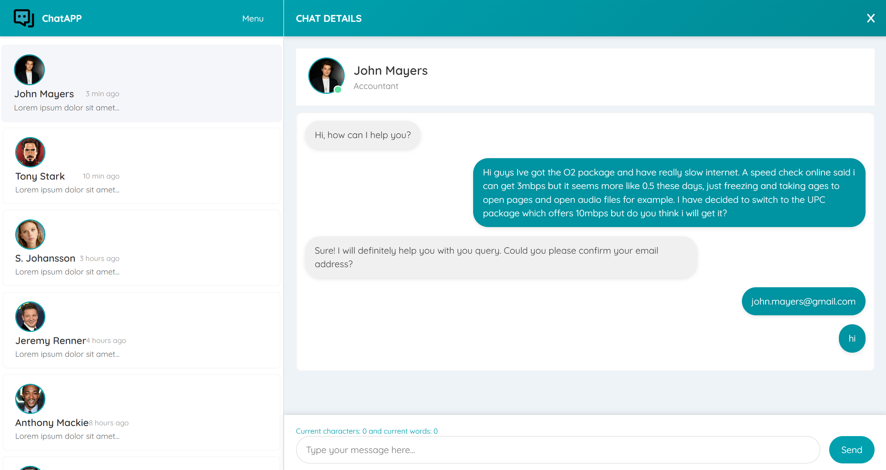

# ChatApp

ChatApp is a responsive, modern chat interface built using HTML, CSS, and vanilla JavaScript. It features a user-friendly design with a sidebar for user lists, a chat area for messages, dynamic theme switching, background customization, real-time character counting, and more.

## Features

- **Responsive Design:** Optimized for both desktop and mobile devices.
- **Dynamic Theme Switching:** Easily switch between themes (red, blue, green, dark, default) using the dropdown menu.
- **Background Customization:** Change the chat area background with a selection of images.
- **User List Search:** Quickly filter users by typing in the search field.
- **Real-Time Character & Word Count:** Monitor the number of characters and words in your message as you type.
- **Interactive Chat Interface:** Seamless messaging with a modern UI, complete with profile details and chat bubbles.

## Demo



## Getting Started

### Prerequisites

- A modern web browser (Chrome, Firefox, Edge, etc.)
- (Optional) A local web server for best results (e.g., [Live Server](https://marketplace.visualstudio.com/items?itemName=ritwickdey.LiveServer) for VS Code)

### Installation

1. **Clone the repository:**

   ```bash
   git clone https://github.com/yourusername/ChatApp.git
   cd ChatApp
